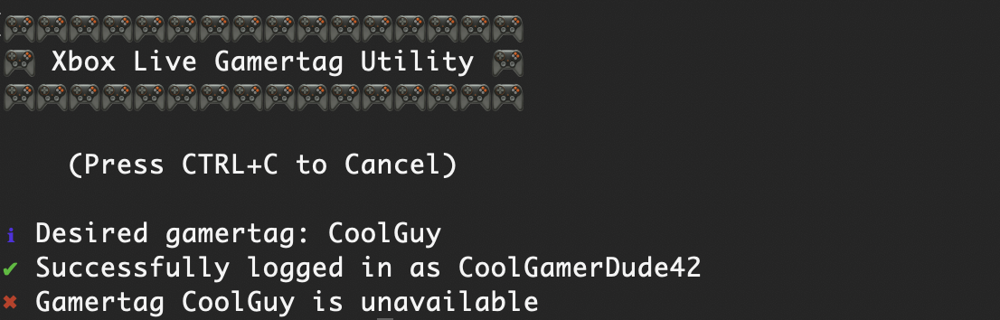

# Xbox Live Gamertag Utility

A Node.js based CLI utility for looking up, monitoring, and claiming gamertags on Xbox Live.



## Installation, Configuration, and Usage

### How to Install

1. Download the latest package `xblgtu` package TGZ file.
1. Ensure you have Node.js installed (including NPM): <https://nodejs.org/en/download>
1. Run the following command to install the utility:
   * `npm i -g xblgtu-1.0.0.tgz`
1. (Optional) Configure a `settings.json` file.
1. Run the following command to start the utility:
   * `xblgtu`

### Defining Settings (`settings.json`)

The utility has the following settings options, to be defined in a `settings.json` file located in the directory from where you call the `xblgtu` command.

|Name|Description|Default|
|-|-|-|
| login | Your Microsoft account login. | (None) |
| password | Your Microsoft account password. | (None) |
| desiredGamertag | Desired Xbox Live Gamertag. | (None) |
| monitorAvailability | Whether to constantly monitor the gamertag until it's available. | false |
| lookupRetryDelaySeconds | The time in seconds to wait between retries to lookup the desired gamertag.<br>_Note: The Microsoft APIs used impose a rate limit of 300 requests per 6 hours._  | 75 |
| autoClaim | Whether to automatically attempt to reserve and claim the desired gamertag when it's available. | false |

### Example File

Here is an example `settings.json` file to automatically provide Microsoft account credentials and continuously monitor the gamertag Major Nelson, and attempt to claim that gamertag if it becomes available:

```json
{
    "login": "CoolGamerDude42@hotmail.com",
    "password": "Hunter2",
    "desiredGamertag": "CoolGuy",
    "monitorAvailability": true,
    "lookupRetryDelaySeconds": 75,
    "autoClaim": true
}
```

## ⚠️ Warning

This is not an officially supported tool. It simply uses existing Microsoft APIs to automate looking up, reserving, and claiming gamertags. These APIs may change without notice, causing this tool to fail.

The Microsoft APIs which this tool uses were not intended for 3rd party integration.

**Disclaimer**: The author of this repository ("Author") does not assume any liability or responsibility for any misuse or damage caused by this software or its source code. The software is provided "as is", and it is the end user's responsibility to ensure they comply with all applicable laws and regulations. The Author expressly disclaims any warranty, either expressed or implied, regarding the software's accuracy, reliability, or suitability for any particular purpose. By using this software, you acknowledge and agree that you are using it at your own risk.
